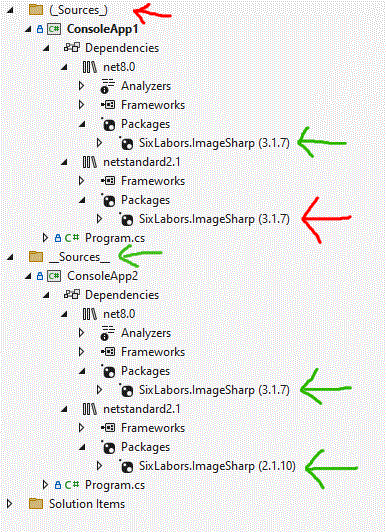

## Overview

This is a proof of concept to demonstrate this extremely weird issue I found after updating to Visual Studio 17.13.xx

I have lots of projects from different sources, located in nested directories mixed with other directories, so a long time ago I came up
with a pattern to ensure that important directories are hilighted and always sorted before all other directories.

This pattern consists of adding of surrounding the name of a directory with "(_ DirectoryName _)" , and this has not been an issue for
Visual Studio until up to 17.13.xx

Also, I have lots of projects which target multiple frameworks, and use conditionals to add the appropiate project references.

After updating to Visual Studio 17.13.xx , I began noticing that many projects that were previously compiling correctly, suddenly began producing lots of errors.

I have other projects that did work correctly, so it was puzzling to say the least.

After a while, I've figured out the condition that makes the projects to stop working, is to have these "(_ DirectoryName _)"  in the path.

## Proof of concept demo

The demo contains two dummy projects, they' exactly the same.

- Both projects target Netstandard2.1 and Net8.0
- Both projects include a package reference, and a conditional to use a different version of the package, based on the current target platform.

The project located in \_\_Sources\_\_  works correctly and detects that it should use package version 2.1.10 instead of 3.1.7.

The project located in (\_Sources\_) fails to run the conditional and uses 3.1.7 version for both target frameworks, making the project to fail.

Here's how it looks in Visual Studio:

